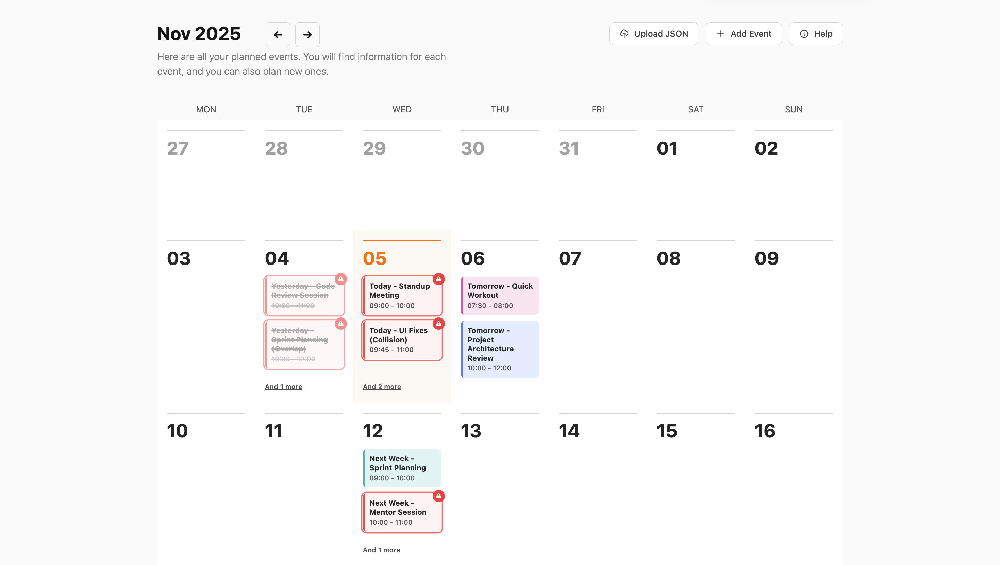

# Calendar

This is a interactive calendar application built with React, TypeScript, Date-fns and Tailwind CSS. It allows users to manage their schedules by adding events manually or by importing them from a JSON file.

## Deployed Link

You can view and use the live application here:

[https://calendar-one-red.vercel.app/](https://calendar-one-red.vercel.app/)

## Features

- **Add Events Manually**: Click the "+ Add Event" button to open a modal and fill in event details, including a color.
- **Import Events from JSON**: Use the "Upload JSON" button to bulk-add events from a formatted JSON file.
- **Event Collision Detection**: The UI highlights events that have overlapping times on the same day.

## Screenshot



## How to Use

### 1. Add an Event Manually

1. Click the "+ Add Event" button.
2. A modal will appear. Fill in the Title, Date, Start Time, End Time, and choose a Color.
3. Click "Create Event". The event will be added to the calendar and saved to your session.

### 2. Upload JSON Data

1. Create a `.json` file that contains an array of event objects.
2. Click the "?" (Help) button to see the exact format required.
3. Click the "Upload JSON" button and select your file.

## JSON Format

Your JSON file must be an array of objects with the following properties:

```json
[
  {
    "date": "YYYY-MM-DD",
    "startTime": "HH:mm",
    "endTime": "HH:mm",
    "title": "Your Event Title",
    "color": "#RRGGBB"
  },
  {
    "date": "2025-11-20",
    "startTime": "10:00",
    "endTime": "11:30",
    "title": "Team Sync",
    "color": "#f87171"
  }
]
```

## Dependencies

dependencies used in this project:

```json
 {
    "@tailwindcss/vite": "^4.1.16",
    "date-fns": "^4.1.0",
    "react": "^19.1.1",
    "react-dom": "^19.1.1",
    "tailwindcss": "^4.1.16"
  },
```
